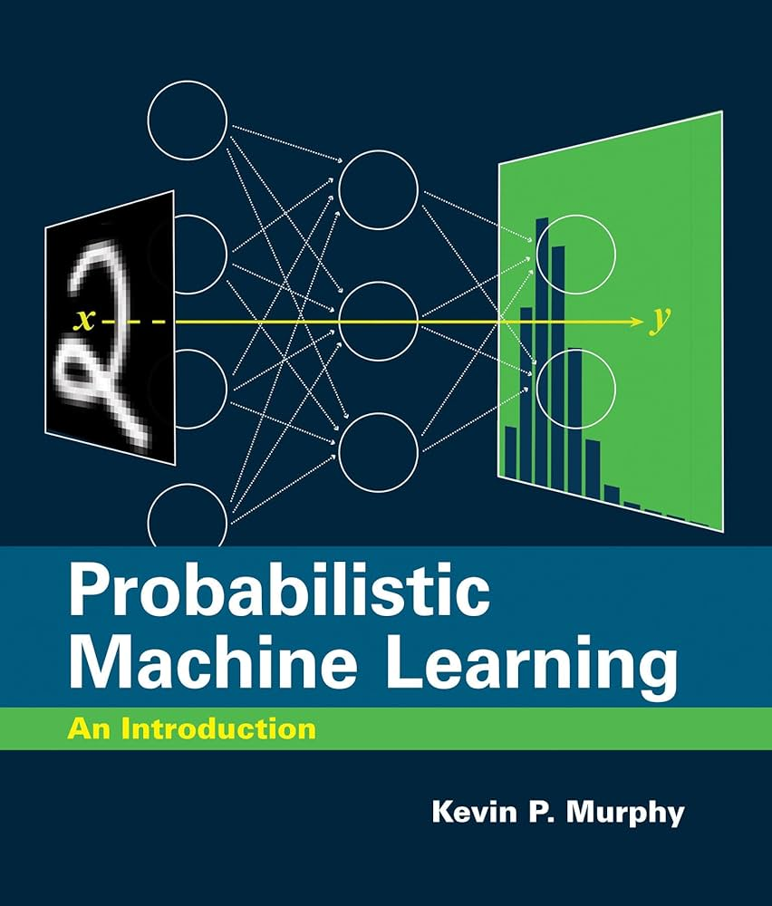
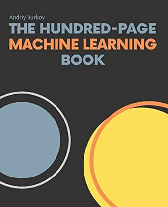

<html lang="en">
<head>
    <meta charset="UTF-8">
    <meta name="viewport" content="width=device-width, initial-scale=1.0">
    <title>My Reading List</title>
    <link rel="stylesheet" href="https://cdnjs.cloudflare.com/ajax/libs/font-awesome/5.15.3/css/all.min.css">
    
    
    
    
</head>
<body>
    <h1>My Reading List</h1>
    

    

        

            <h2>My PubMed Feed</h2>
            
Loading PubMed articles...

            

            

        

        

            <h2>My arXiv Feed</h2>
            
Loading arXiv papers...

            

            

        

    

    

        

            <h2>Recommended Books</h2>

            

                
                

                    <h3>
                        <a href="https://www.amazon.com/Probabilistic-Machine-Learning-Introduction-Computation/dp/0262046822" target="_blank">
                            Probabilistic Machine Learning: An Introduction
                        </a>
                    </h3>
                    
Kevin P. Murphy

                    
I cannot recommend this book enough. I will warn new readers that it is VERY heavy in statistics and mathematics. If you are just starting out, this might be a good book later down the line. 

                

            

            

                
                

                    <h3>                        
                        <a href="https://themlbook.com" target="_blank">
                            The Hundred-Page Machine Learning Book
                        </a>
                        </h3>
                    
 Andriy Burkov

                    
A brief review or description of why this book is recommended. This section allows you to highlight key takeaways or insights that make this book valuable.

                

            

            <!-- Add more books as needed -->

        

        

            <h2>Recommended Papers</h2>

            

                
                

                    <h3>Title of the Paper</h3>
                    
Paper Author

                    
A brief review or description of the paper, focusing on its contributions and why it’s worth reading.

                

            

            

                
                

                    <h3>Title of Another Paper</h3>
                    
Another Paper Author

                    
A brief review or description of the paper, focusing on its contributions and why it’s worth reading.

                

            

            <!-- Add more papers as needed -->
        

    

</body>
</html>
